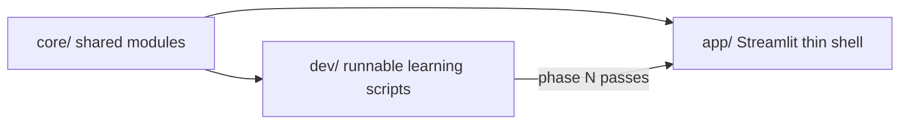
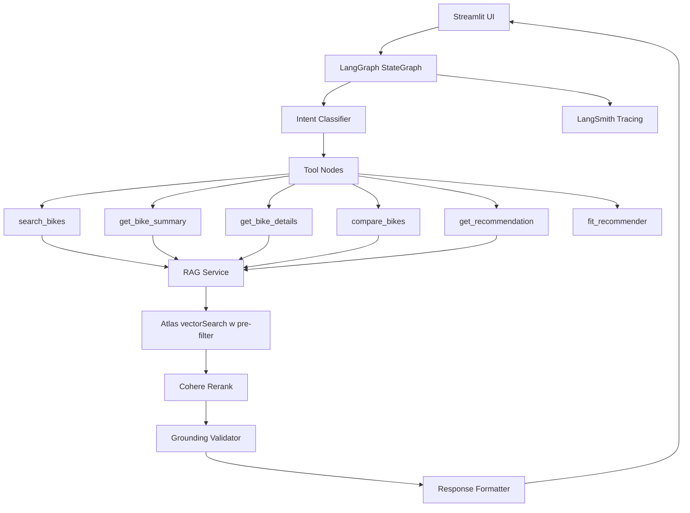

# Cannondale Bikes Assistant — Upgrade Plan

## Progress Tracker

### Phase 0 — Foundation
| File | Status | Notes |
| ---- | ------ | ----- |
| `core/__init__.py` | ✅ done | |
| `core/config.py` | ✅ done | reads .env, validates keys, Settings class |
| `core/rag/__init__.py` | ✅ done | |
| `core/rag/vectorstore.py` | ✅ done | now uses build_embeddings(), lru_cache added |
| `core/rag/retriever.py` | ✅ done | vector search working, returns top-k bikes |
| `core/rag/embeddings.py` | ✅ done | build_embeddings() factory, lru_cache, smoke test |
| `core/llm.py` | ✅ done | build_llm() factory, lru_cache, smoke test |
| `core/tools/` | ✅ done | search, summary, details, compare, recommend + __init__ |
| `core/tools/_helpers.py` | ✅ done | parse_price, extract_image_urls_from_docs |
| `core/prompts/` | ✅ done | __init__ + system/summary/details/compare/recommend.md |
| `dev/README.md` | ✅ done | how to run each phase script |
| `dev/phase_00_config_smoke.py` | ✅ done | verifies settings, imports, Atlas connection |
| Atlas vector index | ✅ done | `vector_index` created on `bikes_collection` |
| `core/agent/` | ⬜ todo | Phase 2 |
| `tests/` | ⬜ todo | |

### Phase 1 — RAG Upgrade
| Item | Status |
| ---- | ------ |
| Switch to `text-embedding-3-small` | ⬜ todo |
| Atlas pre-filters (price, category) | ⬜ todo |
| Cohere reranker | ⬜ todo |

### Phase 2 — LangGraph Agent
| Item | Status |
| ---- | ------ |
| `core/agent/state.py` | ⬜ todo |
| `core/agent/nodes.py` | ⬜ todo |
| `core/agent/graph.py` | ⬜ todo |

### Phase 3 — Evaluation
| Item | Status |
| ---- | ------ |
| Golden queries | ⬜ todo |
| Ragas eval script | ⬜ todo |

### Phase 4 — Streamlit UI
| Item | Status |
| ---- | ------ |
| `app/streamlit_app.py` | ⬜ todo (only after Phase 3 passes) |

## Goal

Lift this project from "working RAG demo" to "senior-level portfolio showpiece" by modernizing the RAG pipeline, migrating to LangGraph, introducing a layered architecture, adding evaluation, and upgrading the app UX.

**Equally important:** this refactor is a **learning exercise**. The work is not only "move code into files"—each module should teach what it does through **generous comments and docstrings**, and every phase must be **runnable from the terminal with visible output** so you can build intuition before touching Streamlit.

## Learning and documentation approach

- **Module docstrings (top of file):** What this module is responsible for, how it fits in the pipeline, and one sentence on when to read it vs skip it.
- **Section comments:** Break files into labeled blocks (e.g. `--- Configuration ---`, `--- Retriever factory ---`).
- **Inline comments:** Explain *why* something is done, not only *what*—especially for LangChain/LangGraph wiring (runnables, message history, graph edges) where the API is non-obvious.
- **Avoid noise:** Do not comment every line; comment every **decision** (e.g. why `k=10` before rerank, why we strip `IMAGE_URL` in the UI).
- **Optional:** a short `LEARNING_NOTES.md` next to `core/agent/` or `core/rag/` with "concepts map" (links to LangGraph docs, MongoDB vector search docs) if you want a study aid—only if you find it useful; not required for the build.

## Development workflow: `dev/` first, `app/` second



- **`core/`** holds the real implementation (config, RAG, tools, agent graph). It is imported by both `dev/` and `app/`.
- **`dev/`** holds **phase-by-phase scripts** you run with `poetry run python ...` (or `python -m` from project root with `PYTHONPATH=src`). Each script is the "lab notebook" for that phase: print results, assert invariants, optionally `pprint` intermediate structures.
- **`app/`** (Streamlit) is built **only after** Phases 0–3 behave as expected in `dev/`. The Streamlit file should mostly call into `core/` and format output—**no** heavy logic duplicated in the UI layer.

**Rule of thumb:** if you cannot demonstrate a feature from `dev/` with printed output, do not yet embed it in Streamlit.

**Running dev scripts (convention):** from the repository root, with `src` on `PYTHONPATH`, e.g. `cd ai_portfolio_projects && PYTHONPATH=src poetry run python src/01_cannondale_bikes_assistant/dev/phase_00_config_smoke.py` (exact path TBD when files exist). Document the one true command in `dev/README.md` so you are not guessing each time.

## Current State (baseline)

- Monolithic 823-line [src/01_cannondale_bikes_assistant/app/app2.py](src/01_cannondale_bikes_assistant/app/app2.py) with tools, agent, UI and state all inline.
- Duplicated tool code across [app.py](src/01_cannondale_bikes_assistant/app/app.py), [app2.py](src/01_cannondale_bikes_assistant/app/app2.py), [02_rag_pipeline.py](src/01_cannondale_bikes_assistant/dev/02_rag_pipeline.py), [03_rag_pipeline_v2.py](src/01_cannondale_bikes_assistant/dev/03_rag_pipeline_v2.py) with drift and silent bugs.
- Outdated embeddings (`text-embedding-ada-002`), no reranker, no pre-filtering, no hybrid search.
- `k=3` retrieval, Python-side post-filtering for price/type (can return empty even when matches exist).
- No streaming, no citations, no evaluation, no tests, no observability.
- Agent uses legacy `AgentExecutor` pattern (not LangGraph).

## Target Architecture



## Target folder layout

```
src/01_cannondale_bikes_assistant/
  app/                            # BUILT LATE: Streamlit only after dev phases pass
    streamlit_app.py              # UI only, thin; imports core/
    components/                   # optional: chat, catalog, citation panel
  core/                           # Shared library—heavily commented
    config.py
    agent/
      graph.py
      state.py
      nodes.py
    tools/
      search.py
      summary.py
      details.py
      compare.py
      recommend.py
      fit.py
    rag/
      vectorstore.py
      retriever.py
      reranker.py
      embeddings.py
    models/
      schemas.py
    prompts/
      *.md
  dev/                            # WHERE YOU DEVELOP AND LEARN
    README.md                     # how to run each phase; checklist order
    phase_00_config_smoke.py      # load settings, print OK / errors
    phase_01_ingest_sample.py     # ingest N docs, print one document + metadata
    phase_01_retrieval_queries.py # fixed queries, print top-k + scores
    phase_01_rerank_smoke.py      # same queries before/after rerank (compare prints)
    phase_02_graph_invoke.py      # one user message, print AgentState or node outputs
    phase_02_graph_stream.py      # stream tokens to stdout (no Streamlit)
    phase_03_eval_local.py         # run subset of golden set, print metrics table
    # ...add or split files as needed; names are examples
    _archive/                     # optional: old 02_*.py kept for diff reference only
  evaluation/
    golden_queries.yaml
    ragas_eval.py
    eval_report.md
  tests/                          # pytest mirrors dev/ scenarios for CI
    test_tools.py
    test_retriever.py
    test_agent_graph.py
  scripts/                        # one-off maintenance (optional; can live under dev/)
    reembed_migration.py
```

**Per-phase verification (run and see output):** each phase in the rollout table below lists the **dev script(s)** to run and what you should see (stdout). Automated `pytest` can mirror the same scenarios later for CI.

| Phase | dev script (example) | What “passing” looks like |
| ----- | -------------------- | ------------------------- |
| 0 | `phase_00_config_smoke.py` | Prints validated env (redact secrets), exits 0 |
| 1 | `phase_01_ingest_sample.py` | Counts written docs, prints one with metadata |
| 1 | `phase_01_retrieval_queries.py` | For 3–5 fixed queries, prints bike names and optional scores |
| 1 | `phase_01_rerank_smoke.py` | Order of top results changes after rerank (printed before/after) |
| 2 | `phase_02_graph_invoke.py` | Final answer + retrieved bike IDs in state |
| 2 | `phase_02_graph_stream.py` | Chunks print to terminal as they arrive |
| 3 | `phase_03_eval_local.py` + full `ragas_eval.py` | Table of metrics + written `eval_report.md` |
| 4 | Streamlit (manual) | Same behavior as phase 2 scripts, in browser |

## Phased rollout

### Phase 0 — Cleanup and foundation (2-3 days)

**Learning goal:** understand how config centralization and module boundaries prevent “works on my machine” bugs.

- **Archive (do not silently delete) for learning:** move legacy [app.py](src/01_cannondale_bikes_assistant/app/app.py) and broken notebooks-as-scripts [02_rag_pipeline.py](src/01_cannondale_bikes_assistant/dev/02_rag_pipeline.py), [03_rag_pipeline_v2.py](src/01_cannondale_bikes_assistant/dev/03_rag_pipeline_v2.py) to `dev/_archive/` with a one-line `README` explaining why they are retired (Jupyter magics in `.py`, known bugs at `query` / `except` / `msgs` order). Keeps git history and your ability to compare “before vs after.”
- Evolve [01_create_vectorstore.py](src/01_cannondale_bikes_assistant/dev/01_create_vectorstore.py) into `dev/phase_01_ingest_sample.py` + shared `core/rag/ingest.py` (strip `%load_ext autoreload`, CLI for `--limit`, idempotent upserts). **Comment every non-trivial step:** what each `Document` field is for, why metadata matters for filtering.
- Create `core/config.py` with `pydantic-settings` — validate `OPENAI_API_KEY`, `MONGO_DB_URI`, optional `COHERE_API_KEY`, `LANGSMITH_API_KEY`. Docstring should list each variable and whether it is required for local dev.
- Extract `@tool` functions from [app2.py](src/01_cannondale_bikes_assistant/app/app2.py) into `core/tools/*.py`. **Each tool file:** module docstring + comment block per tool describing *when the LLM should call it* (mirrors your existing tool docstrings, but keep them in code next to implementation).
- Prompts in `core/prompts/*.md` with a short header comment in each file (role, inputs, output shape).
- **`dev/phase_00_config_smoke.py`:** import `get_settings()`, print which keys are loaded (never print secret values), exit 0/1.
- Set up `pytest`, `ruff`, optional `mypy` in CI — tests can start as copies of dev smoke checks.

**End of Phase 0 (ready to invest in RAG changes):** `phase_00_config_smoke.py` runs clean; `core/` is importable; tools live under `core/tools/`; legacy scripts live in `dev/_archive/` with a short README. Ingest: `phase_01_ingest_sample.py` with `--limit 5` (or similar) can write a small batch and print one document—proves the pipeline before full re-embed.

### Phase 1 — RAG pipeline upgrade (3-4 days)

**Learning goal:** see retrieval quality change as you change embeddings, chunking, filters, and reranking—**print-driven**, not only “it feels better in chat.”

- **Embeddings:** migrate from `text-embedding-ada-002` to `text-embedding-3-small`. One-off: `scripts/reembed_migration.py` (repo root) or `dev/reembed_migration.py` re-embeds all 327 docs; **comment the migration** with a warning block at top: run once, what it does to Atlas.
- **Data model:** in ingestion, store `price_usd` as `float` and add derived `category`, `is_electric`, `wheel_size_mm`. Inline comments: map CSV quirks (e.g. `"16,000"`) to numeric once at ingest, not on every query—contrast with current [app2.py](src/01_cannondale_bikes_assistant/app/app2.py) `parse_price` hot path.
- **Atlas vector index with filters:** document in `core/rag/vectorstore.py` how the index name and filter paths line up with MongoDB UI (link to Atlas docs in module docstring).
- **Hybrid search:** `core/rag/retriever.py` — **heavy comments** on the two-stage or compound query: when vector wins vs when text must win.
- **Reranker:** `CohereRerank` — top-20 then top-5; comment *why* 20/5 and what to tune.
- **Chunking:** `Document` builder in shared ingest — two logical docs per bike; comment how a “specs question” vs “what is this bike for” hits different chunks.

**dev verification for Phase 1:**

- `dev/phase_01_retrieval_queries.py` — 3–5 **fixed strings** in a list at top of file; loop and print `rank`, `model_code` or `bike_model`, and distance/score if available. Lets you re-run after every RAG change and diff output.
- `dev/phase_01_rerank_smoke.py` — same fixed queries, print list before rerank, list after, with a one-line comment on expected qualitative change.
- Optional: `dev/phase_01_atlas_filter_only.py` — if pre-filter API is testable in isolation, print “how many docs match price < X” from Mongo to verify index filters without the LLM.

**Gate before Phase 2:** retrieval scripts show sensible bikes for the fixed queries; rerank visibly reorders in at least one case.

### Phase 2 — LangGraph agent (4-5 days)

**Learning goal:** the agent is a **state machine**; each node is a small, testable function. Comments on the graph should read like a short design doc: “this edge runs when intent is `compare`.”

- `core/agent/graph.py` — `StateGraph` with nodes: `classify_intent` -> `route_tool` -> `retrieve` -> `rerank` -> `generate` -> `validate_grounding` -> `format_response` (names adjustable). **Each node function:** docstring = inputs/outputs, side effects, what gets appended to state.
- `core/agent/state.py` — Pydantic or TypedDict `AgentState`: `messages`, `intent`, `retrieved_bikes`, `citations`, `answer`, `token_usage`. Field-level comments.
- `validate_grounding` — comment the heuristic (e.g. allow model_code only if in retrieved set).
- Conversation summarization after N turns — comment default N and how to change it.
- **Streaming in two steps:** (1) `dev/phase_02_graph_stream.py` — `graph.astream` prints chunks to **stdout**; (2) Phase 4 — same async generator wired to `st.write_stream`. Do not skip the terminal step.
- **LangSmith (optional in dev):** env flag to enable; comment in `graph.py` how tracing maps node names in the trace UI.

**dev verification for Phase 2:**

- `dev/phase_02_graph_invoke.py` — one hard-coded user string; `invoke` or sync stream; `pprint` final state (truncate long fields). Proves the graph end-to-end without Streamlit.
- `dev/phase_02_graph_stream.py` — proves token/chunk stream.

**Gate before Phase 3:** both scripts run; answers are grounded on retrieved bikes for the test prompt.

### Phase 3 — Evaluation harness (2 days)

**Learning goal:** RAG quality is **measured**, not felt. Comments in `ragas_eval.py` on what each metric means and when it lies.

- `evaluation/golden_queries.yaml` — 30–50 queries, expected `model_code`s, optional short gold answer snippets.
- `evaluation/ragas_eval.py` — `faithfulness`, `answer_relevancy`, `context_precision`, `context_recall`, plus `correct_bikes_retrieved`. **Print** a text table to stdout; **append** run metadata to `evaluation/eval_report.md`.
- `dev/phase_03_eval_local.py` — runs a **small subset** (e.g. 5 queries) for fast iteration without full cost; same code path as full eval, documented at top of file.

**Gate before Phase 4:** full eval at least once on main branch; numbers recorded in `eval_report.md` with date.

### Phase 4 — Streamlit UI (3-4 days) — only after Phases 0–3 pass in `dev/`

**Learning goal:** the UI is **wiring and layout**, not RAG logic—keep files short; import from `core/`.

- Refactor or replace [app2.py](src/01_cannondale_bikes_assistant/app/app2.py) with `app/streamlit_app.py` that **only** calls the same `invoke` / `astream` entrypoints you already tested in `dev/phase_02_*.py`.
- **Streaming responses**: `st.write_stream` with the async stream from `core/agent/graph.py` (same as terminal stream).
- **Source citation panel** (right sidebar): after each response, render cards showing the 3-5 retrieved bikes with image, name, price, and the specific specs cited.
- **Structured comparison view**: `compare_bikes` returns `ComparisonResult` Pydantic model; render as `st.dataframe` with sortable columns + CSV export button.
- **Catalog browse tab**: grid of bike cards with sidebar filters (price slider, type checkboxes, wheel size, electric toggle). "Ask about this bike" button pre-fills chat.
- **Suggested follow-ups** after each AI response (3 clickable chips).
- **Feedback buttons** (thumbs up/down) that log to LangSmith with `client.create_feedback`.
- **Session persistence**: chat history keyed by `session_id` saved to MongoDB.

### Phase 5 — Tier 2 extra features (2-3 days)

**Learning goal:** not everything needs an LLM—**deterministic tools** with clear inputs/outputs and tests.

- **Bike fit recommender** (`core/tools/fit.py`): height/inseam/riding style -> frame size + 2-3 model candidates. Heavy comments on sizing tables or rules; no hidden magic.
- **`dev/phase_05_fit_smoke.py`:** prints recommended size and candidate models for 2-3 example riders (hard-coded in script).
- **Recommendation export:** PDF from Streamlit (reportlab or weasyprint); optional `dev/phase_05_pdf_smoke.py` to generate a sample PDF to disk for verification without the UI.

### Phase 6 — Optional Tier 3 (stretch, ~1-2 weeks)

- **Multi-modal**: upload a bike image -> GPT-4o vision describes -> query vectorstore -> return match. Killer demo.
- **FastAPI backend** at `backend/app/main.py` exposing `/chat` as SSE. Streamlit becomes thin client. Unlocks reusability.
- **Deploy**: Dockerize multi-stage, deploy to Hugging Face Spaces or Fly.io. Add live demo URL to README.
- **Blog writeup**: "6 ways I upgraded my RAG app" with before/after eval scores.

## Key Dependencies to Add

- `pydantic-settings`, `langgraph`, `langsmith`, `langchain-cohere`, `ragas`, `pytest`, `mypy`, `reportlab` (or `weasyprint` for PDF).
- Remove `chromadb`, `onnxruntime`, `pulsar-client`, `wikipedia`, `firestore`, `firecrawl-py` from [pyproject.toml](pyproject.toml) if unused in the final project.

## Recommended default path

Stopping after **Phase 3** still yields a **strong learning arc** (config -> RAG -> agent -> eval) with every step runnable from `dev/`. You will have:
- A commented `core/` library you can read later as a study guide
- Console scripts that prove each layer
- Published evaluation numbers

Streamlit (Phase 4) then becomes a thin capstone. Phase 5-6 are polish and stretch.

## Where this plan document lives

The canonical file is under Cursor: `.cursor/plans/cannondale-rag-upgrade-plan_*.md`. If you want it **versioned in git**, copy or symlink it to e.g. [src/01_cannondale_bikes_assistant/UPGRADE_PLAN.md](src/01_cannondale_bikes_assistant/UPGRADE_PLAN.md) and update the project README to link to it. **`dev/README.md`** should be the *operational* index (how to run each phase script, in order)—not a duplicate of the full architecture essay.

## Non-Goals

- Not rewriting the scraper / data collection pipeline — CSV data is sufficient.
- Not replacing MongoDB Atlas with Pinecone/Qdrant — Atlas works well for this scale.
- Not building a mobile app.

## Risks & Mitigations

- **Re-embedding cost**: 327 docs x `text-embedding-3-small` = negligible (~$0.001). Safe.
- **Atlas index rebuild**: must recreate the vector index when embedding dim changes (1536 for ada-002 -> 1536 for 3-small -> same dim actually, but dense layout differs). Plan a one-off migration window.
- **LangGraph learning curve:** keep the mermaid diagram in the project README; Phase 2 includes buffer for first-time graph debugging.
- **Breaking existing behavior during refactor:** Phase 3 eval harness and `dev/phase_01_retrieval_queries.py` golden outputs act as regression checks — re-run after every major RAG or graph change.
- **Comment debt vs. velocity:** default to “comment the why and the sharp edges” in `core/`; do not require essay-length blocks in `dev/` beyond file-level `"""How to run this."""` unless a script is used for teaching a specific concept.
