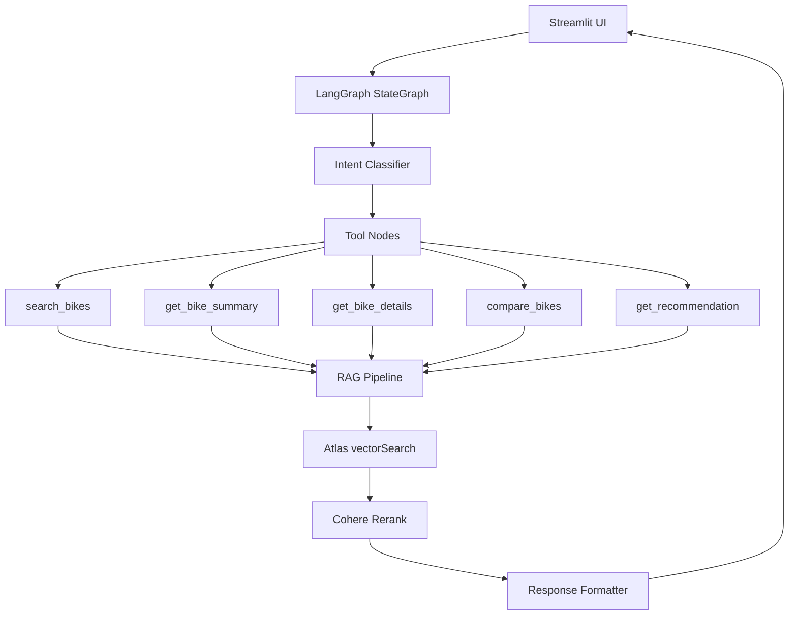

# Cannondale Bikes Assistant — Upgrade Plan

> **Ground rules**
>
> - Data is already in MongoDB Atlas. **No re-ingesting, no re-embedding.**
> - Every phase is verified with **in-script test blocks** (`## %%` cells at the bottom of each file). Run them in VS Code interactive mode or as a plain Python script — not from the terminal with one-off commands.
> - Build order: pipeline → agent → app. Do not touch the app until the pipeline and agent are stable.

---

## Progress Tracker

### Phase 0 — Foundation ✅

| File | Status | Notes |
| ---- | ------ | ----- |
| `core/__init__.py` | ✅ done | |
| `core/config.py` | ✅ done | pydantic-settings, validates keys |
| `core/rag/__init__.py` | ✅ done | |
| `core/rag/embeddings.py` | ✅ done | `build_embeddings()` factory, lru_cache |
| `core/rag/vectorstore.py` | ✅ done | `build_embeddings()`, lru_cache |
| `core/rag/retriever.py` | ✅ done | vector search, returns top-k bikes |
| `core/llm.py` | ✅ done | `build_llm()` factory, lru_cache |
| `core/tools/` | ✅ done | search, summary, details, compare, recommend + `__init__` |
| `core/tools/_helpers.py` | ✅ done | `parse_price`, `extract_image_urls_from_docs` |
| `core/prompts/` | ✅ done | `__init__` + system/summary/details/compare/recommend.md |
| `dev/phase_00_config_smoke.py` | ✅ done | verifies settings, imports, Atlas connection |
| Atlas vector index | ✅ done | `vector_index` on `bikes_collection` |

### Phase 1 — RAG Pipeline (done)

| Item | Status | Notes |
| ---- | ------ | ----- |
| Cohere reranker | ⏭ skipped | No API key — reranker.py exists but unused |
| Upgrade retriever | ✅ done | `core/rag/retriever.py` — falls back to plain vector search |
| In-script retrieval tests | ✅ done | `if __name__` block verified, 5 queries returning results |

### Phase 2 — Agent

| Item | Status | File |
| ---- | ------ | ---- |
| `core/agent/state.py` | ⬜ todo | AgentState TypedDict |
| `core/agent/nodes.py` | ⬜ todo | node functions |
| `core/agent/graph.py` | ⬜ todo | StateGraph wiring |
| In-script invoke test | ⬜ todo | `## %%` blocks in `graph.py` |
| In-script stream test | ⬜ todo | `## %%` blocks in `graph.py` |

### Phase 3 — App

| Item | Status | File |
| ---- | ------ | ---- |
| `app/streamlit_app.py` | ⬜ todo | thin shell, imports core/ only |
| Streaming responses | ⬜ todo | `st.write_stream` |
| Citation panel | ⬜ todo | sidebar bike cards |
| Comparison view | ⬜ todo | `st.dataframe` |
| Catalog browse tab | ⬜ todo | filters + "Ask about this bike" |

### Phase 4 — Eval

| Item | Status |
| ---- | ------ |
| Golden queries | ⬜ todo |
| Ragas eval script | ⬜ todo |

---

## Goal

Lift this project from "working RAG demo" to "senior-level portfolio showpiece" by upgrading the RAG pipeline, migrating to LangGraph, and rebuilding the app UI on top of a clean layered architecture.

---

## Architecture



---

## Folder Layout

```text
src/01_cannondale_bikes_assistant/
  app/
    streamlit_app.py              # UI only — imports core/, no logic here
    components/                   # optional: chat, catalog, citation panel
  core/
    config.py
    llm.py
    agent/
      graph.py                    # StateGraph
      state.py                    # AgentState
      nodes.py                    # node functions
    tools/
      search.py
      summary.py
      details.py
      compare.py
      recommend.py
    rag/
      embeddings.py
      vectorstore.py
      retriever.py
      reranker.py                 # NEW in Phase 1
    prompts/
      *.md
  dev/
    README.md
    phase_00_config_smoke.py      # done
    _archive/
  evaluation/                     # Phase 4
    golden_queries.yaml
    ragas_eval.py
    eval_report.md
```

---

## Phase 1 — RAG Pipeline Upgrade

**Goal:** better retrieval quality using data already in MongoDB. No changes to stored documents.

### What to build (Phase 1)

**`core/rag/reranker.py`**

- Wrap `CohereRerank` as a callable: takes a list of `Document`s + query string, returns reranked top-N docs.
- Default `top_n=5` (reranking from a larger candidate set of 20).
- In-script test block: fixed query, print bike names before and after rerank — order should visibly change.

**`core/rag/retriever.py` — upgrade**

- Increase candidate retrieval to `k=20` before reranking, down to `top_n=5` after.
- Wire reranker: `retrieve(k=20)` → `rerank(top_n=5)`.
- Keep `parse_price` in Python — data is in MongoDB with existing field types, no metadata changes.
- In-script test block: 3–5 fixed queries, print ranked bike names + scores.

### Testing (Phase 1)

Each file has `## %%` cell blocks at the bottom (same pattern as existing tools files). Run in VS Code interactive mode or as `python <file>`. Tests live in the file — no separate scripts needed.

### Gate to Phase 2

- `reranker.py` test block runs and prints reordered results.
- `retriever.py` test block returns sensible bikes for each fixed query.

---

## Phase 2 — LangGraph Agent

**Goal:** replace the legacy `AgentExecutor` pattern with a proper `StateGraph`. Each node is a small, testable function.

### What to build (Phase 2)

**`core/agent/state.py`**

- `AgentState` as a `TypedDict`: `messages`, `intent`, `retrieved_bikes`, `citations`, `answer`.
- Field-level comments explaining what each field holds and when it is populated.

**`core/agent/nodes.py`**

- One function per node: `classify_intent`, `call_tool`, `generate_response`.
- Each function: docstring with inputs → outputs, what it appends to state.

**`core/agent/graph.py`**

- Wire nodes into `StateGraph`: intent classify → route → tool call → generate.
- In-script test blocks at bottom:
  - `## %% [invoke]` — one hard-coded query, `graph.invoke(...)`, print final answer + retrieved bike names.
  - `## %% [stream]` — same query with `graph.stream(...)`, print chunks as they arrive.

### Gate to Phase 3

- Invoke block runs end-to-end and returns a grounded answer.
- Stream block prints chunks (proves streaming works before wiring Streamlit).

---

## Phase 3 — Streamlit App

**Goal:** thin UI shell that calls the same `graph.invoke` / `graph.stream` already tested in Phase 2. No RAG logic in the UI layer.

### What to build (Phase 3)

- `app/streamlit_app.py` — imports `core/agent/graph.py` and `core/tools/`, nothing else.
- **Streaming**: `st.write_stream` connected to the async stream from Phase 2.
- **Citation panel**: sidebar cards showing retrieved bikes (image, name, price) after each response.
- **Comparison view**: `compare_bikes` output rendered as `st.dataframe` with CSV export.
- **Catalog tab**: bike grid with sidebar filters (price, type, electric). "Ask about this bike" pre-fills chat.
- **Suggested follow-ups**: 3 clickable chips after each AI response.

### Gate (Phase 3)

- All Phase 2 behavior works in browser.
- No logic duplicated between `app/` and `core/`.

---

## Phase 4 — Evaluation (optional)

- `evaluation/golden_queries.yaml` — 30–50 queries with expected bike model codes.
- `evaluation/ragas_eval.py` — `faithfulness`, `answer_relevancy`, `context_precision`, `context_recall`. Prints table, appends to `eval_report.md`.
- Run a small subset (5 queries) first to verify the pipeline before full cost.

---

## Phase 5 — Stretch

- **Bike fit recommender** (`core/tools/fit.py`): height/inseam/style → frame size + candidates. In-script test block.
- **PDF export**: recommendation summary as PDF (reportlab or weasyprint).
- **Multi-modal**: upload bike image → GPT-4o vision → vectorstore match.
- **Deploy**: Docker + Hugging Face Spaces or Fly.io.

---

## Key Dependencies

- Already needed: `langchain-cohere` (reranker), `langgraph`.
- Optional: `langsmith`, `ragas`, `reportlab`.
- Review and remove unused deps from `pyproject.toml`: `chromadb`, `onnxruntime`, `pulsar-client`, `wikipedia`, `firestore`, `firecrawl-py`.

---

## Non-Goals

- No re-ingesting or re-embedding data — MongoDB content stays as-is.
- No replacing MongoDB Atlas with another vector store.
- No mobile app.
- No separate terminal test scripts — tests live as `## %%` blocks inside each module.
