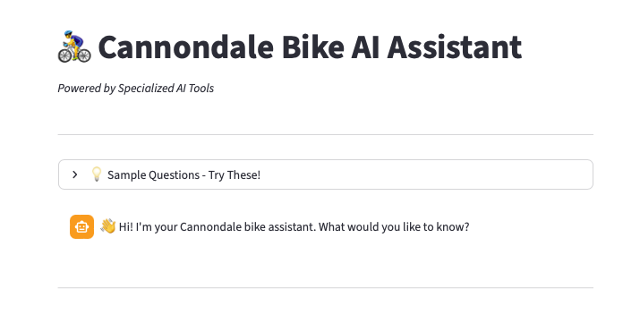
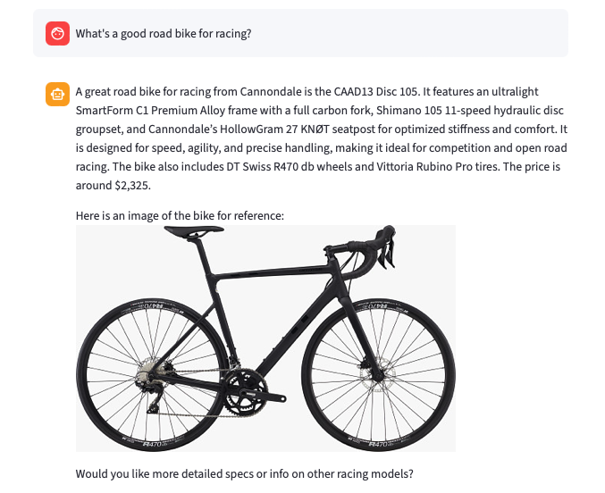
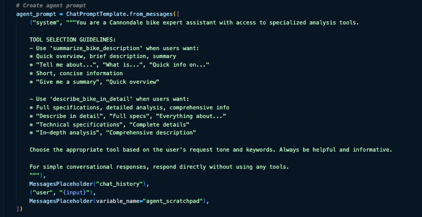
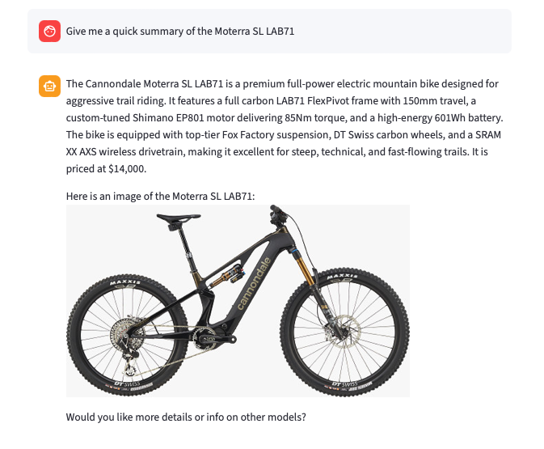
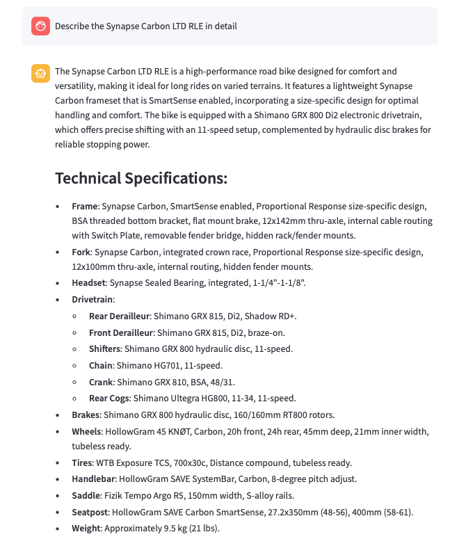

# 🚴‍♂️ Cannondale Bikes AI Assistant
 ***A RAG System with Conversational Memory***

<div align="center">

</div>


---
### 📋 **Project Overview**

Shopping for a bike online means drowning in technical specs across dozens of models. This project tackles that problem with a **Retrieval-Augmented Generation (RAG)** system that acts like a knowledgeable bike shop assistant. It answers questions about Cannondale bikes in plain English, remembers your conversation, and tracks exactly which models it's recommending.

#### 🎯 **Key Concepts Explored**

- **RAG Architecture**: Combining vector search with LLMs to ground AI responses in real data.
- **Conversational AI**: Multi-turn dialogue that understands follow-up questions.
- **Vector Database**: Using MongoDB for semantic search across 200+ bike specifications.
- **Prompt Engineering**: Crafting context-aware prompts that deliver both concise summaries and detailed technical analysis.
- **Tool Use**: Enabling the LLM to query databases and retrieve structured information

---

### 🏗️ **How It Works**

The system uses an **agent-based architecture** where an AI agent decides which specialized tool to use based on your question. Ask for a "quick summary" and it uses the summary tool. Ask for "detailed specs" and it switches to the detailed analysis tool. Each tool retrieves relevant bikes information from MongoDB, applies a different prompt template, and returns formatted results with bike images and specifications.

<div align="center">

</div>

#### **The Agent Pipeline**

1. **Agent Decision**: Analyzes your query and conversation history to select the appropriate tool
2. **Vector Search**: The chosen tool retrieves top 3 relevant bikes from MongoDB using semantic similarity
3. **Prompt Template**: Applies either a summary or detailed template to the retrieved context
4. **Response Generation**: LLM synthesizes the answer with bike images and metadata

<div align="center">

</div>

#### **Conversational Memory**

Streamlit-based chat history maintains context across the session, allowing natural follow-up questions.

<div align="center">

</div>

#### **Dual Response Modes**

**Summary Mode** - Quick overviews for rapid comparison:

<div align="center">

</div>

**Detailed Mode** - Comprehensive technical specifications:

<div align="center">

</div>

#### **Technical Stack**
```
🧠 LLM: OpenAI GPT-4.1-mini
🔍 Embeddings: OpenAI text-embedding-ada-002
🗄️ Vector Store: MongoDB Atlas with vector search
🌐 Frontend: Streamlit
🔗 Framework: LangChain (Agent + Tools architecture)
```

---

### 🚀 **Getting Started**

#### **Prerequisites**

- Python 3.8+
- Poetry (Python package manager)
- OpenAI API key
- MongoDB Atlas account (with vector search enabled)

#### **Installation**

1. **Clone the repository**
```bash
git clone https://github.com/LucasO21/ai_portfolio_projects.git
cd <your-repo-name>
```

2. **Install dependencies**
```bash
poetry install
```

3. **Set up environment variables**

Create a `.env` file in the project root:
```bash
OPENAI_API_KEY=your_openai_api_key_here
MONGO_URI=your_mongodb_connection_string
MONGO_DB_NAME=your_database_name
MONGO_COLLECTION_NAME=your_collection_name
```

4. **Prepare your bike data**

Ensure your MongoDB collection contains bike documents with embeddings and metadata (bike specs, images, etc.).
Follow [this script](https://github.com/LucasO21/ai_portfolio_projects/blob/main/src/01_cannondale_bikes_assistant/dev/01_create_vectorstore.py) to ingest and embed your bike data if needed.

#### **Running the App**
```bash
poetry run streamlit run src/01_cannondale_bikes_assistant/app/app.py
```

The app will open in your browser at `http://localhost:8501`

#### **Try These Queries**

**For summaries:**
- "Give me a quick summary of the Moterra SL LAB71"
- "Tell me about the Scalpel mountain bike"
- "What's a good road bike for racing?"

**For detailed specs:**
- "Show me details about gravel bikes under $3000"
- "Describe the Topstone Carbon 1 RLE in detail"
- "What are the full specifications of the Jekyll 1?"

---


