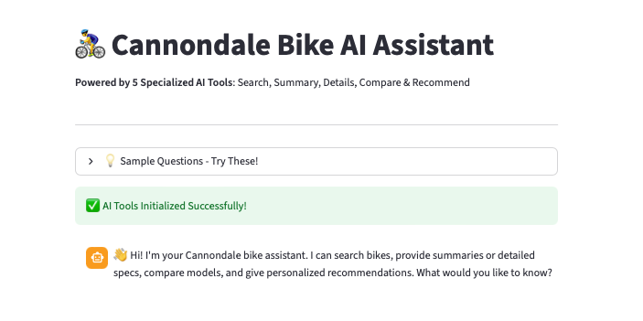
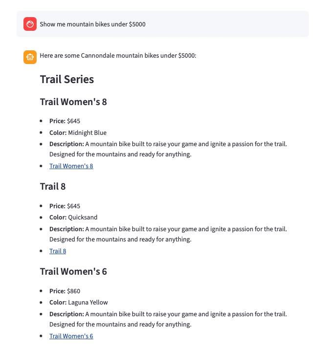
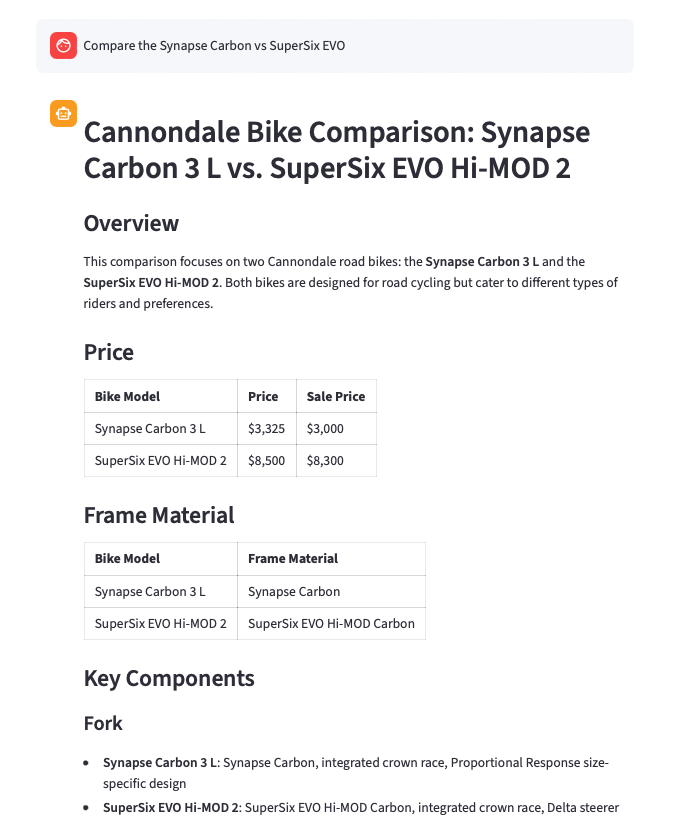
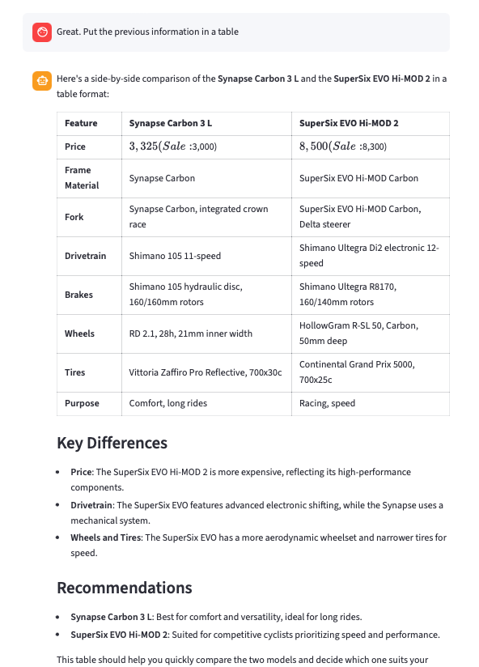

# 🚴‍♂️ Cannondale Bikes AI Assistant
***An Agentic RAG System with Tool-Calling and Conversational Memory***

<div align="center">

</div>

---

## 📋 Project Overview

Shopping for a high-end bicycle online means sifting through hundreds of models, each with dense technical specifications spread across product pages. Comparing frames, drivetrains, and pricing across the Cannondale lineup is time-consuming and overwhelming, especially for riders who aren't sure what they need.

This project tackles that problem with an **agentic RAG (Retrieval-Augmented Generation) system** that acts like a knowledgeable bike shop employee. It uses an AI agent backed by five specialized tools to search, summarize, detail, compare, and recommend Cannondale bikes — all through natural conversation. The agent decides which tool to invoke based on the user's intent, retrieves relevant bike data from a MongoDB Atlas vector store, and synthesizes responses grounded in real product specifications scraped from [cannondale.com](https://www.cannondale.com/en-us).

What makes this implementation interesting is the **tool-calling agent architecture**: rather than a single RAG chain, the system routes queries through purpose-built tools, each with its own prompt template and retrieval strategy. This enables the assistant to handle everything from quick overviews to detailed side-by-side comparisons within a single conversational interface.

### 🎯 Key Concepts Explored

- **Agentic RAG Architecture**: An AI agent that autonomously selects from five specialized tools based on user intent, going beyond simple question-answering.
- **Tool-Calling with LangChain**: Defining structured tools with typed arguments (price ranges, bike types, experience levels) that the LLM invokes as function calls.
- **Vector Search**: Semantic similarity search over bike specifications stored in MongoDB Atlas, with post-retrieval filtering by price and category.
- **Conversational Memory**: Multi-turn dialogue using Streamlit chat history, allowing natural follow-up questions like "what about the carbon version?" after an initial query.
- **Prompt Engineering**: Five distinct prompt templates optimized for different response modes — summaries, detailed specs, comparisons, recommendations, and search results.

---

## 🏗️ How It Works

The system uses an **agent-based architecture** where GPT-4o decides which specialized tool to use based on your question. Ask for a "quick summary" and it uses the summary tool. Ask to "compare the Synapse vs CAAD13" and it routes to the comparison tool. Each tool retrieves relevant bike data from MongoDB via vector similarity search, applies its own prompt template, and returns formatted results with bike images.

```
                        ┌─────────────────────┐
                        │     User Query       │
                        │  (Streamlit Chat)    │
                        └──────────┬───────────┘
                                   │
                        ┌──────────▼───────────┐
                        │   GPT-4o Agent        │
                        │  (Tool Selection)     │
                        └──────────┬───────────┘
                                   │
              ┌────────────────────┼────────────────────┐
              │          │         │         │           │
     ┌────────▼──┐ ┌─────▼────┐ ┌─▼──────┐ ┌▼────────┐ ┌▼───────────┐
     │  Search   │ │ Summary  │ │Details │ │Compare │ │Recommend  │
     │  Bikes    │ │  Tool    │ │ Tool   │ │ Tool   │ │  Tool     │
     └────────┬──┘ └─────┬────┘ └─┬──────┘ └┬────────┘ └┬───────────┘
              │          │        │          │           │
              └──────────┴────────┼──────────┴───────────┘
                                  │
                     ┌────────────▼────────────┐
                     │   MongoDB Atlas          │
                     │   Vector Search          │
                     │  (text-embedding-ada-002)│
                     └────────────┬─────────────┘
                                  │
                     ┌────────────▼────────────┐
                     │   Formatted Response     │
                     │  + Bike Images           │
                     └─────────────────────────┘
```

### The Pipeline

1. **User Query**: The user asks a question in the Streamlit chat interface.
2. **Agent Decision**: GPT-4o analyzes the query and conversation history, then selects the appropriate tool — `search_bikes`, `get_bike_summary`, `get_bike_details`, `compare_bikes`, or `get_recommendation`.
3. **Vector Retrieval**: The chosen tool queries MongoDB Atlas using `text-embedding-ada-002` embeddings to find the most relevant bike documents via semantic similarity search.
4. **Post-Filtering**: Results are optionally filtered by bike type, price range, or budget constraints using structured tool arguments.
5. **Response Generation**: The retrieved context is fed through a tool-specific prompt template, and GPT-4o synthesizes a formatted answer with bike images and metadata.

### Five Specialized Tools

| Tool | Purpose | Key Features |
|------|---------|-------------|
| **Search Bikes** | Browse and filter the catalog | Filters by bike type, min/max price range |
| **Bike Summary** | Quick 3-4 sentence overview | Concise with bullet-point highlights |
| **Bike Details** | Full technical specifications | Comprehensive specs, components, metadata |
| **Compare Bikes** | Side-by-side comparison (2-3 bikes) | Structured tables with recommendations |
| **Get Recommendation** | Personalized suggestions | Considers budget, experience level, riding style |

### Code Snippet (Bike Summary Tool)

The `get_bike_summary` tool retrieves relevant bike documents via vector search, extracts image URLs from metadata, then chains the context through a summary-specific prompt template to produce a concise overview with bullet points.

```python
@tool
def get_bike_summary(bike_query: str) -> str:
    """Provide a concise summary of a Cannondale bike."""
    retriever = get_retriever()
    llm = get_llm()

    docs = retriever.invoke(bike_query)
    image_data = extract_image_urls_from_docs(docs)

    summary_template = """You are a Cannondale bike expert.
        Provide a CONCISE SUMMARY (3-4 sentences max) of the bike.

        Context: {context}
        Query: {question}

        Instructions:
        - Keep it brief and focused on the most important features
        - Mention bike type, key technology, and target use
        - Include price if available
        - Follow with 4-5 bullet points of key specs

        Summary:"""

    prompt = ChatPromptTemplate.from_template(summary_template)
    chain = (
        {"context": retriever, "question": RunnablePassthrough()}
        | prompt
        | llm
        | StrOutputParser()
    )

    result = chain.invoke(bike_query)

    for img in image_data:
        result += f"\n\nIMAGE_URL: {img['url']} | {img['name']}"

    return result
```

### Agent Configuration

The agent prompt defines tool selection guidelines so GPT-4o can route queries to the right tool. The `AgentExecutor` wraps the agent with tool access, conversation history, and iteration limits.

```python
AGENT_PROMPT = ChatPromptTemplate.from_messages([
    ("system", """You are a Cannondale bike expert assistant with access to 5 tools.

    TOOL SELECTION GUIDELINES:
    1. 'search_bikes'       → browse, filter, list bikes by criteria
    2. 'get_bike_summary'   → quick overview of a specific bike
    3. 'get_bike_details'   → full specs and technical breakdown
    4. 'compare_bikes'      → side-by-side comparison of 2-3 bikes
    5. 'get_recommendation' → personalized suggestion based on needs

    Always include IMAGE_URL lines from tool output verbatim."""),
    MessagesPlaceholder("chat_history"),
    ("human", "{input}"),
    MessagesPlaceholder("agent_scratchpad"),
])

def create_agent_executor() -> AgentExecutor:
    llm = get_llm()
    agent = create_tool_calling_agent(llm, TOOLS, AGENT_PROMPT)
    return AgentExecutor(
        agent=agent,
        tools=TOOLS,
        verbose=False,
        handle_parsing_errors=True,
        max_iterations=5,
        return_intermediate_steps=True,
    )
```

---

## 🛠️ Tech Stack

```
🧠 LLM:         OpenAI GPT-4o
🔍 Embeddings:  OpenAI text-embedding-ada-002
🗄️ Data Store:  MongoDB Atlas (vector search)
🌐 Frontend:    Streamlit
🔗 Framework:   LangChain (Agent + Tools architecture)
📦 Other:       pymongo, python-dotenv
```

---

## 🚀 Getting Started

### Prerequisites

- Python 3.9+
- OpenAI API key
- MongoDB Atlas account (with vector search index enabled)

### Installation

1. **Clone the repository**
```bash
git clone https://github.com/LucasO21/ai_portfolio_projects.git
cd ai_portfolio_projects
```

2. **Create a virtual environment and install dependencies**
```bash
python -m venv venv
source venv/bin/activate  # On Windows: venv\Scripts\activate
pip install -r requirements.txt
```

3. **Set up environment variables**

Create a `.env` file in the project root:
```bash
OPENAI_API_KEY=your_openai_api_key_here
MONGO_DB_URI=your_mongodb_connection_string
```

4. **Prepare the vector store**

Load the bike data CSV into MongoDB Atlas and create embeddings:
```bash
# Run the vectorstore creation script
python src/01_cannondale_bikes_assistant/dev/01_create_vectorstore.py
```

Ensure your MongoDB Atlas cluster has a **vector search index** named `vector_index` on the `cannondale_bikes_db.bikes_collection` collection.

### Running the Application

```bash
streamlit run src/01_cannondale_bikes_assistant/app/app2.py
```

The app will be available at `http://localhost:8501`

---

## 💡 Example Usage

### Search & Filter Bikes

**Query:** "Show me mountain bikes under $5000"

<div align="center">

</div>

The search tool retrieves bikes via semantic similarity, then post-filters by the "mountain" bike type and the $5,000 max price. Results include model names, prices, colors, and image links for each match.

### Side-by-Side Comparison

**Query:** "Compare the Synapse Carbon vs SuperSix EVO"

<div align="center">

</div>

The comparison tool retrieves data for each bike independently, builds a combined context, and generates a structured table covering frame, drivetrain, brakes, wheels, and pricing — along with recommendations for which rider each bike suits.

### Conversational Follow-ups

**Query:** "Put the previous information in a table"

<div align="center">

</div>

Chat history persists across the session, so the agent can reformat, refine, or extend previous answers without the user restating context.

---

## 📁 Project Structure

```
src/01_cannondale_bikes_assistant/
├── app/
│   ├── app2.py                  # Main Streamlit application (v2)
│   └── app.py                   # Legacy v1 application
├── dev/
│   ├── 01_create_vectorstore.py # Data ingestion & embedding pipeline
│   ├── 02_rag_pipeline.py       # RAG experimentation notebook
│   └── 03_rag_pipeline_v2.py    # RAG v2 experimentation with tools
├── database/
│   └── bikes_csv/
│       ├── bikes_version_1.csv  # Initial scraped bike data
│       └── bikes_version_2.csv  # Updated bike data (used in production)
├── png/                         # Application screenshots
└── README.md
```

---
