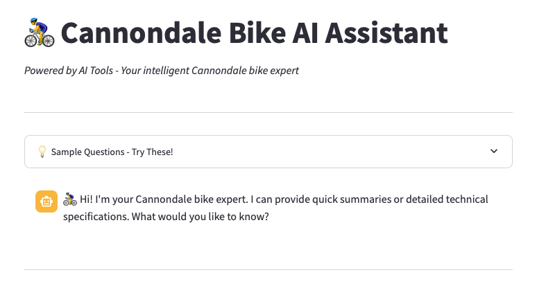
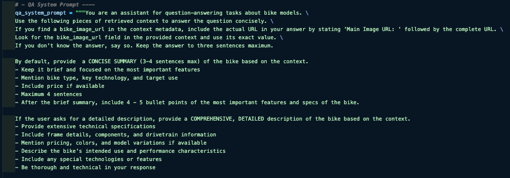
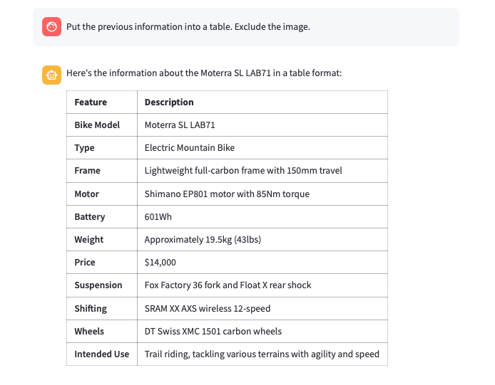
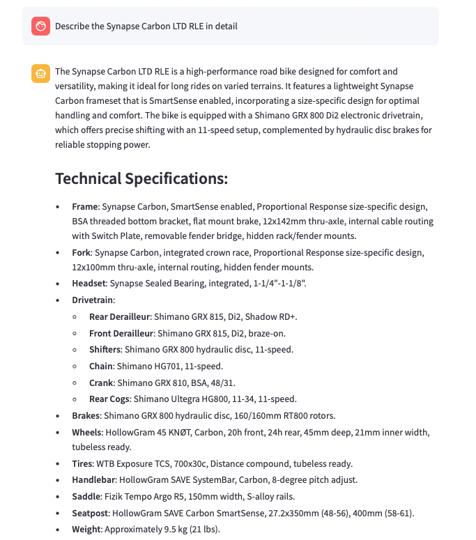
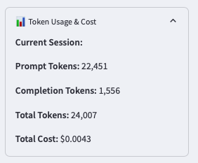

# 🚴‍♂️ Cannondale Bikes AI Assistant
## *RAG System with Conversational Memory*

---

### 📋 **Project Overview**

This project demonstrates a **Retrieval-Augmented Generation (RAG)** system built for Cannondale bicycle expertise. The application shows AI concepts including conversational memory, context-aware retrieval, and document processing in a Streamlit interface.

---

### 🎯 **What This Project Shows**

- **RAG Architecture**: How to build retrieval-augmented generation systems
- **Conversational AI**: Multi-turn conversations with memory
- **Vector Database**: ChromaDB for semantic search and document retrieval
- **Prompt Engineering**: Context-aware prompts with metadata
- **Cost Tracking**: Real-time token tracking and usage monitoring

---

### 🏗️ **System Architecture**



#### **RAG Pipeline Components**

1. **Vector Database**: ChromaDB storing 200+ Cannondale bike specifications with embeddings
2. **History-Aware Retriever**: Contextualizes current queries using conversation history
3. **Document Chain**: Processes retrieved documents with custom prompt templates
4. **Memory System**: Streamlit-based chat history with session persistence

#### **Technical Stack**
```
🧠 LLM: OpenAI GPT-4o-mini
🔍 Embeddings: OpenAI text-embedding-ada-002
🗄️ Vector Store: ChromaDB with persistence
🌐 Frontend: Streamlit with custom UI components
🔗 Framework: LangChain for orchestration
```

---

### 🚀 **Key Features**

#### **1. Smart Query Processing**


The system employs a **two-stage retrieval process**:
- **Context Reformulation**: Converts follow-up questions into standalone queries
- **Semantic Retrieval**: Finds relevant bike specifications using vector similarity
- **Response Generation**: Synthesizes answers with proper source attribution

#### **2. Conversational Memory & Context**


**Memory Implementation**:
- Persistent chat history across user sessions
- Context-aware follow-up question handling
- Conversation state management with LangChain's `RunnableWithMessageHistory`

#### **3. Dual Response Modes**

**Summary Mode** - Quick overviews for rapid decision-making:


**Detailed Analysis** - Comprehensive technical specifications:


---

### 💡 **RAG Techniques**

#### **History-Aware Retrieval**
```python
# Context reformulation for follow-up queries
contextualize_q_system_prompt = """Given a chat history and the latest user question
which might reference context in the chat history, formulate a standalone question
which can be understood without the chat history."""
```

#### **Document Prompt Engineering**
The system uses custom document templates to ensure metadata (including bike specifications and image URLs) is properly exposed to the LLM:

```python
document_prompt = PromptTemplate.from_template(
    "Content:\n{page_content}\n\nMetadata:\n{metadata}"
)
```

#### **Retrieval Chain Architecture**
- **Stage 1**: History-aware query reformulation
- **Stage 2**: Vector similarity search (k=5 documents)
- **Stage 3**: Document synthesis with context preservation

---

### 📊 **Additional Features**

#### **Cost Monitoring & Analytics**


Real-time tracking of:
- Prompt tokens consumed
- Completion tokens generated
- Total cost calculation
- Session-based usage analytics

#### **Error Handling**
- Fallbacks for vector database connectivity issues
- Input validation and error messages
- Exception handling with user feedback

---

### 📈 **Potential Extensions**

This foundation supports additional features:
- Multi-modal RAG with image processing
- Fine-tuned embeddings for bicycle domain
- A/B testing for prompt optimization
- Integration with external APIs for real-time inventory

---

*This project shows practical AI engineering skills through a complete RAG application with conversational memory and cost tracking.*
